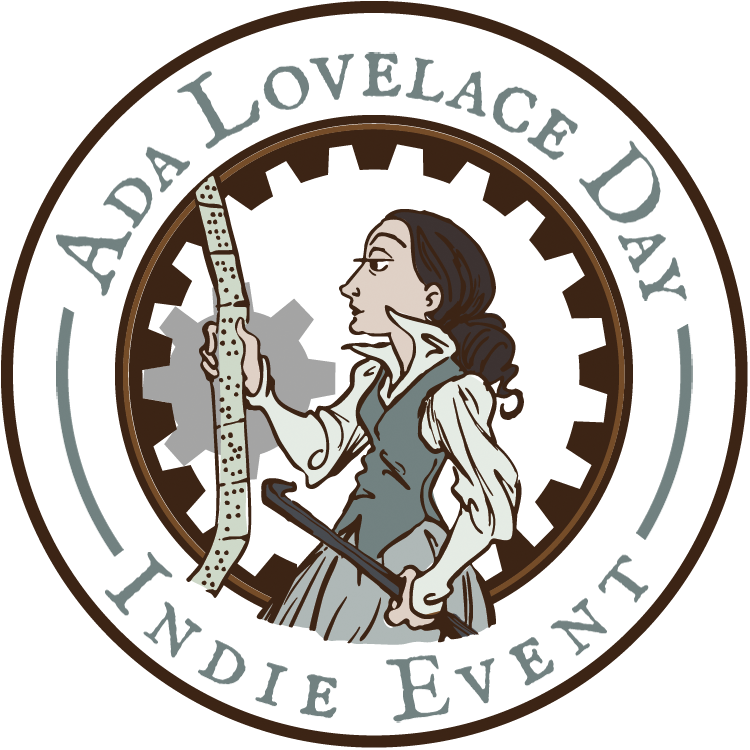

# Ada Lovelace Day 2023 at SUNY Geneseo

Join us for Geneseo's celebration of **Ada Lovelace Day 2023!** We'll be celebrating women in STEM (Science, Technology, Engineering, and Math) as well as the connections between STEM and the arts and humanities.

All events in the **MacVittie Union College Ballroom**.

## Schedule

### 9 am - 12 noon

- [Dr. Serenity Sutherland](https://serenitysutherland.com/), Assistant Professor of Communication Studies at SUNY Oswego, will exhibit her digital humanities project [Visualizing Women in Science](https://diglib.amphilsoc.org/womeninscience/) and explain how network graphs can provide important insights into human relationships.
- Following Dr. Sutherland's presentation, participants will help make women scientists more visible on [Wikipedia](https://en.wikipedia.org) by adding biographical and other content to these scientists' pages. *Never edited Wikipedia before? It's easy. We'll have some cheat sheets available on this website, and helpers will be on hand to guide you through the process.*

### 1 pm - 2 pm

Geneseo Professor of English [Lytton Smith](https://www.geneseo.edu/english/smith) will lead a workshop on **poetry and generative artificial intelligence**.

### 2 pm - 3 pm

Geneseo Associate Professor of Phyics [Anne Pellerin](https://www.geneseo.edu/physics/pellerin) ​will give a presentation on **​neglected histories of women​ who've made important contributions to physics and astronomy**.

## What is Ada Lovelace Day?

Ada Lovelace Day is an [international celebration of the achievements of women in STEM](https://findingada.com) held each year since 2009 on the second Tuesday in October. Since that day falls during Geneseo's fall break, we're marking ALD on October 12, after classes are back in session. But if you have a chance to check out the streaming events on October 10, we encourage you to do so!

## Who was Ada Lovelace?

Born in 1815, [Ada August King, Countess of Lovelace](https://en.wikipedia.org/wiki/Ada_Lovelace), collaborated with inventor [Charles Babbage](https://en.wikipedia.org/wiki/Charles_Babbage) on his general purpose computing machine, the Analytical Engine. In 1843, Lovelace published what we would now call a computer program to generate Bernoulli Numbers. Although Babbage had written fragments of programs before, Lovelace's was the most complete, most elaborate and the first published. 

More important, Lovelace was the first person to foresee the creative potential of the Engine. She explained how it could do so much more than merely calculate numbers, and could potentially create music and art, given the right programming and inputs. Her vision of computing's possibilities was unmatched by any of her peers and went unrecognised for a century.

Ada Lovelace also saw poetry in numbers&mdash;no surprise, perhaps, given that she was the daughter of one of England's most famous romantic poets, George Gordon, Lord Byron. 

*Portrait of Ada Lovelace, 1838. <a href="https://commons.wikimedia.org/wiki/File:Ada_Lovelace_1838.jpg">William Henry Mote</a>, Public domain, via Wikimedia Commons*

