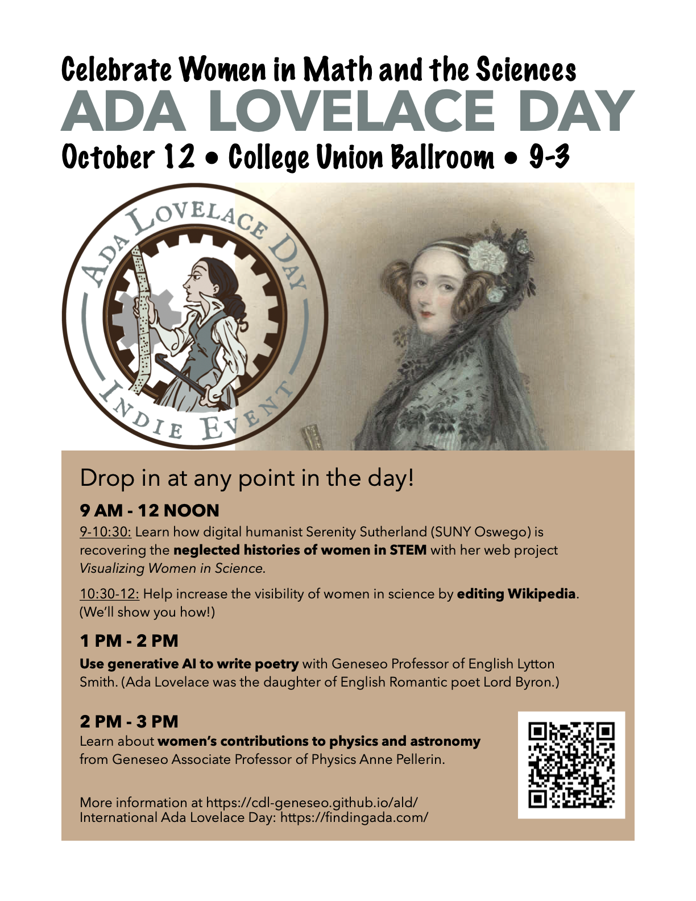

# Ada Lovelace Day 2024 at SUNY Geneseo

## Celebrate Women in Math and the Sciences!

Ada Lovelace Day is an [international celebration of the achievements of women in STEM](https://findingada.com) held each year since 2009 on the second Tuesday in October.

This year, SUNY Geneseo be marking Ada Lovelace Day with a poster session, a presentation by Professor and Chair of Political Science and International Relations [Karleen West](https://www.geneseo.edu/provost/karleen_west) on [collaborative efforts to support women in STEM at primarily undergraduate institutions in the U.S.](https://wp.geneseo.edu/coplacplan/), and a live stream of the speakers presenting at the Royal Institution, London.

## Schedule for Ada Lovelace Day at SUNY Geneseo

### Poster Session | 2:00&ndash;4:00 p.m. | ISC Atrium

Celebrate Geneseo women in STEM! Students will share posters in the ISC Atrium.

### Presentation | 1:45&ndash;2:30 p.m. | ISC 137

Learn from [Dr. Karleen West](https://www.geneseo.edu/provost/karleen_west), Professor and Chair of Political Science and International Relations, how Geneseo is [supporting women in STEM at primarily undergraduate institutions nationwide](https://wp.geneseo.edu/coplacplan/) through a grant from the National Science Foundation.

### Watch Party | 2:30&ndash;4:30 p.m. | ISC 137 and Atrium

The International Ada Lovelace Day event at the Royal Institution in London, England, will be streamed live in ISC 137 and the ISC Atrium, featuring these presentations:

- Dr Evgenia Ilyinskaya, volcanologist: The Grindavík eruption in Iceland
- Mamta Singhal MBE, design engineer: The science and engineering behind the humble rubber duck
- Takita Bartlett-Lashley, mathematician: Using crafts to introduce mathematical concepts to children
- Dr Samantha Terry, radiobiologist: The use of targeted radionuclide therapy in cancer treatments
- Joysy John MBE, software engineer and education entrepreneur: The role of technology in education
- Dr Sarah Bearchell, science writer, presenter, and trainer will create clouds live on stage!
- Prof Anjali Goswami, paleobiologist: Why cats are evolutionarily perfect

<!-- Join us for Geneseo's celebration of **Ada Lovelace Day 2023!** We'll be celebrating women in STEM (Science, Technology, Engineering, and Math) as well as the connections between STEM and the arts and humanities.

All events in the **MacVittie Union College Ballroom**.

## What is Ada Lovelace Day?

Ada Lovelace Day is an [international celebration of the achievements of women in STEM](https://findingada.com) held each year since 2009 on the second Tuesday in October. Since that day falls during Geneseo's fall break, we're marking ALD on October 12, after classes are back in session. But if you have a chance to check out the streaming events on October 10, we encourage you to do so! -->

## Who was Ada Lovelace?

Born in 1815, [Ada August King, Countess of Lovelace](https://en.wikipedia.org/wiki/Ada_Lovelace), collaborated with inventor [Charles Babbage](https://en.wikipedia.org/wiki/Charles_Babbage) on his general purpose computing machine, the Analytical Engine. In 1843, Lovelace published what we would now call a computer program to generate Bernoulli Numbers. Although Babbage had written fragments of programs before, Lovelace's was the most complete, most elaborate and the first published. 

More important, Lovelace was the first person to foresee the creative potential of the Engine. She explained how it could do so much more than merely calculate numbers, and could potentially create music and art, given the right programming and inputs. Her vision of computing's possibilities was unmatched by any of her peers and went unrecognised for a century.

Ada Lovelace also saw poetry in numbers&mdash;no surprise, perhaps, given that she was the daughter of one of England's most famous romantic poets, George Gordon, Lord Byron. 

<!-- 

*Portrait of Ada Lovelace, 1838. <a href="https://commons.wikimedia.org/wiki/File:Ada_Lovelace_1838.jpg">William Henry Mote</a>, Public domain, via Wikimedia Commons*

-->

