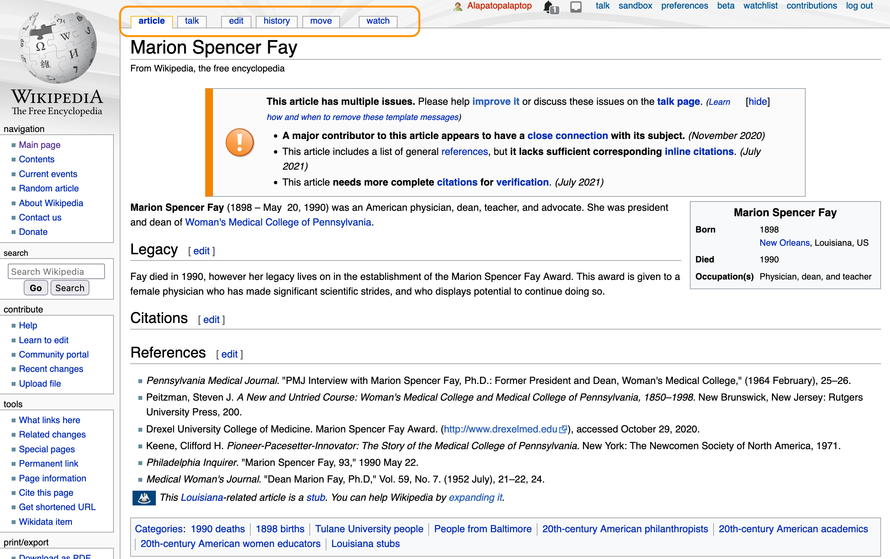
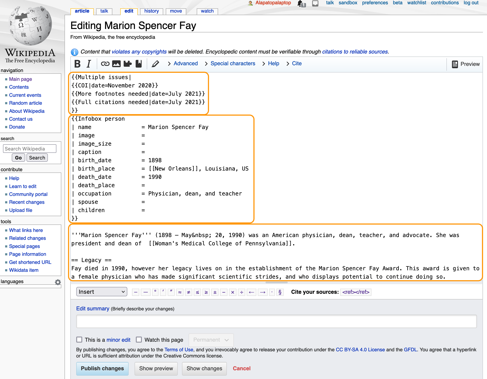

# Anatomy of a Wiki Article

Let's say you've decided to edit the article on American physician, dean, teacher, and advocate [Marion Spencer Fay](https://en.wikipedia.org/wiki/Marion_Spencer_Fay). If you're logged in, the page will look like this. You can use the tabs across the top to view the article's "talk" page, where Wikipedians discuss the article's contents, its "edit" page, where you can make changes to the contents, and its "history" page, where you can revisit all previous edits to the article and compare changes across edits.

Previous editors have flagged this article as one that needs improvement. Here's a chance for us to help make Wikipedia better!

## Click "edit" to begin editing

After you click "edit", you'll see the article content in wikitext. In the graphic below, the orange boxes separate the wikitext for the "Multiple issues" warning, the "Infobox" that appears on the published article's right side, and the beginning of the article text. Note the tripled single-quotes around Fay's name to format it as bold and the doubled equal signs around "Legacy" to format it as a level-2 heading.

## Preview, describe, and submit changes

At the bottom of the editing interface, you'll see buttons to *preview* your changes and make sure they look the way you intend them to, *describe* your changes in an "edit summary" so other Wikipedians can easily understand what you did, and *publish* your changes.

When you publish your changes, they will be visible to *anyone in the world* who goes to this page on Wikipedia!