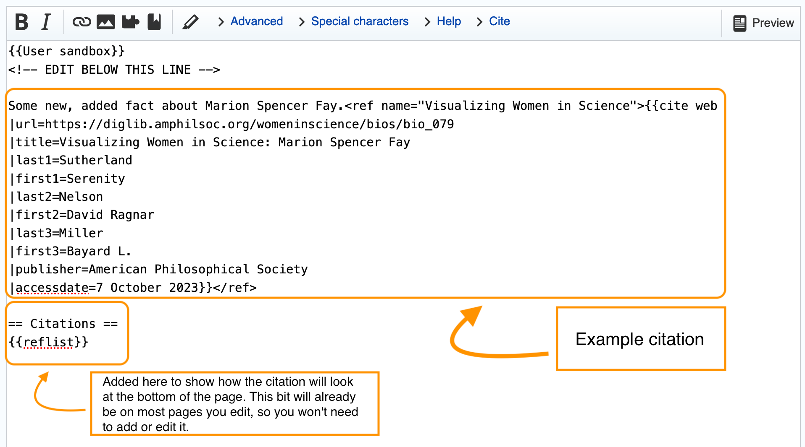
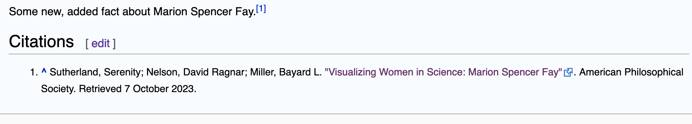

# Citing Your Sources

What sets Wikipedia apart from traditional encyclopedias is the ability of *anyone* with a computer and an internet connection to contibute to it. For ordinary people who want to contribute to the world's stock of knowledge, this feature is enormously empowering.

For anyone who turns to Wikipedia in search of knowledge, however, this feature presents an obvious challenge: how to know whether the information encountered there is reliable.

This is why, when you add information to Wikipedia, it's essential that you cite your sources.

Adding citations to a Wikipedia entry is a bit of an art. Fortunately, for our Ada Lovelace Day edit-a-thon we'll be citing one source, [Visualizing Women in Science](https://diglib.amphilsoc.org/womeninscience/). This will greatly simplify our task.

## Website citations on Wikipedia

To cite a website on Wikipedia, we need the following information:

- The URL of the web page with the information in question
- The name of the website
- A title for the citation
- The date the website was retrieved for the information in question

To cite a scientist's page from [Visualizing Women in Science](https://diglib.amphilsoc.org/womeninscience/), then, we'll need the URL of the page for that scientist. We'll use the following convention to title the citation:

```
Visualizing Women in Science: Name Of Scientist
```
## An example citation

To return to the example of Marion Spencer Fay from our earlier discussion of the [Anatomy of a Wiki Article]({{ site.url}}/wiki/anatomy-of-a-wiki-article), here's how we might cite additional information that we add to the page.

{: .example}
Some new, added fact about Marion Spencer Fay.\<ref name="Visualizing Women in Science">\{\{cite web  
|url=https://diglib.amphilsoc.org/womeninscience/bios/bio_079  
|title=Visualizing Women in Science: Marion Spencer Fay  
|accessdate=12 October 2023\}\}\</ref\>

Let's break this down to get a better understanding of what's going into our citation.

## The ref tag

Our citation is contained within the html element `<ref>`. The whole reference is enclosed within an opening `<ref>` tag and the corresponding closing tag, `</ref>`.

```html
<ref>yada yada yada    
</ref>
```

Our opening `<ref>` tag also contains a bit of additional information in the form of an html *attribute-value* pair&mdash; `name="Visualizing Women in Science"`&mdash; where `name` is the attribute and "Visualizing Women in Science" is the value of that attribute. So a fuller representation of our example would be this:

```html
<ref name="Visualizing Women in Science">yada yada yada
</ref>
```
## The cite web template

Wikitext allows for "templates," which are bits of text enclosed in doubled curly brackets: {{ }}.

The {{cite web}} template (so named because it's for citing a website as source) has three lines inside it, each beginning with a horizontal bar or "pipe" symbol: `|`. So schematically, the structure looks like this:

{: .example}
\{\{cite web  
|url=someurl  
|title=some title  
|accessdate=some date\}\}

## Putting it all together

When we put the {{cite web}} template inside the `<ref>` element, we get the following:

{: .example}
Content needing citation.\<ref name="Some Name">\{\{cite web  
|url=someurl  
|title=some title  
|accessdate=some date\}\}\</ref\>

## To repeat

Here, to repeat, is our example citation for some new fact about Marion Spencer Fay for which we want to cite the *Visualizing Women in Science* website. It follows the general structure described above: a {{cite web}} template inside an html `<ref>` element. Hopefully the above explanation has made it easier to understand.

{: .example}
Some new, added fact about Marion Spencer Fay.\<ref name="Visualizing Women in Science">\{\{cite web  
|url=https://diglib.amphilsoc.org/womeninscience/bios/bio_079  
|title=Visualizing Women in Science: Marion Spencer Fay  
|accessdate=12 October 2023\}\}\</ref\>

## Try it yourself

Before trying to add a citation to a live Wikipedia page, you may want to practice in your [sandbox]({{ site.url }}/wiki/create-a-sandbox). In the editing interface, our example citation would look like what you see below. (In the illustration, a level-two heading and the {{reflist}} template have been added to show how the citation looks at the bottom of the page. These will already exist on most Wikipedia pages you edit; you won't need to add or edit them. But adding them in your sandbox trial-run, exactly as shown here, will help you understand how your citation code generates the corresponding footnote.)

Notice that Wikipedia autonumbers any citations you add and automatically links the superscript number in the article's body text to the citation at the bottom of the section or page.

### Editor view



### Published view



