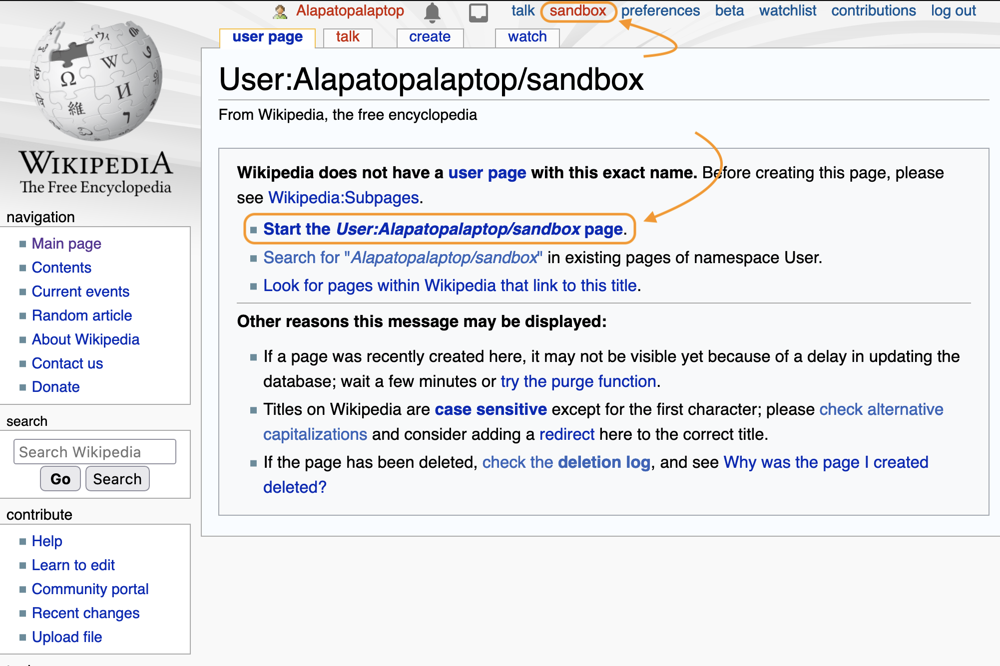

# Create a Sandbox (Optional)

Once you've created an account and logged in, you'll see that you can create a personal sandbox where you can practice your Wikipedia editing.

Creating a sandbox is optional. It's just a handy place to practice your editing. If you haven't created an account, you can use the [all-users sandbox page](https://en.wikipedia.org/wiki/Wikipedia:Sandbox). No login is required.

