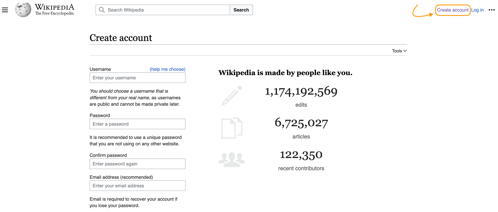

# Create an Account

You can edit Wikipedia anonymously, but you'll only be credited for your edits if you create an account and log in before editing.

Registering an account also enables you to create a personal sandbox where you can practice your Wikipedia editing skills.

On the [Wikipedia homepage](https://en.wikipedia.org), click on "Create account" to bring up the account creation page. Be sure to use a unique, secure password and save it in a safe location.

